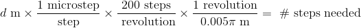

# The Chess Express

An implementation of "Wizard's Chess" - an automatically moving chessboard. Initially developed as part of ECE 395, Advanced Digital System Lab at the University of Illinois, Urbana-Champaign, Fall 2019.

Developers: [Mitalee Bharadwaj](https://www.github.com/mitaleeb) and [Dean Biskup](https://www.github.com/dbisk)

## Abstract

This project is inspired by "Wizard Chess", introduced in _Harry Potter and the Sorcerer's Stone_. It is an automagically moving chessboard, utilizing metal feet on the chesspieces and an electromagnet in order to move pieces around the board. Internally, the project uses an X-Y plotter setup with belts and stepper motors to accurately move the electromagnet head to the location of the pieces, and to accurately drag the pieces to their new positions. The Chess Express also automatically moves pieces to a "graveyard" once they've been taken, and given a promotion is able to move dead pieces back onto the board.

## Physical Design

### Overview

The physical chessboard design utilizes an X-Y plotter, with two stepper motors for the X-axis and one stepper motor for the Y-axis. This configuration was chosen because the X-axis motors would have to move an entire bar of metal, while the Y-axis motor only has to move the electromagnet module. The increased power from having two stepper motors makes moving the bar easier, as well as simplifies the mechanical design because the two outside rails do not need to be connected by belts.

### Drawing

## Motor Control

### MCU Hardware

In order to control the motors, we decided to opt for a driver made by SparkFun called the ["Easy Driver"], which lets us interface with a stepper motor with just 5 input pins. The input pins that we used are the following:

| Pin  | Connection | PURPOSE                                         |
| ---- | ---------- | -------                                         |
| EN   | GPIO0_X    | Enable motor control. Active Low.               |
| STEP | GPIO0_Y    | Move one step upon transition from low to high. |
| DIR  | GPIO0_Z    | Direction of the motor.                         |
| MS1  | GROUND     | Microstep resolution.                           |
| MS2  | GROUND     | Microstep resolution.                           |

note: GPIO0_X is some GPIO0 pin. Each are on different pins. For exact pinning, see the diagram elsewhere in this doc.

We also soldered the logic-level jumper on the board together in order to set the configuration of VCC to be 3.3V, which is the same as the VCC of the LPC1114/102 chip.

By using the Easy Driver, we are able to abstract the motor controls into just the pins listed above. Since we force the MS1/MS2 pins to be either high or low, we don't need to connect them to the processor. This means that for both axes, we just need a total of 3 x 2 = 6 pins, which fits on one GPIO bus. We choose GPIO0. 

### MCU Software

In software, we can control the movement of the motors by changing the values of the `EN`, `DIR`, and `STEP` pins based on the distance and direction we want to move. The process boils down to the following:
```
1. enable the motor
2. set the direction
3. trigger a step the amount of times for the specified direction
```

In order to figure out how many steps we need to go a certain distance, we need some parameters of the motor (we use a [NEMA 16 stepper motor from SparkFun]). The equation for this motor is as follows:



where _d_ is the distance intending to be traveled, in meters. Once we have this, we can set up a control loop that steps the motor the number of steps needed, like follows:
```
setPinGPIO0(X_AXIS_EN, PIN_LOW); // enable the motor control
setPinGPIO0(X_AXIS_DIR, direction); // set the direction
while (numSteps != 0) { // loop for the number of steps
  setPinGPIO0(X_AXIS_STP, PIN_HIGH);
  lpcWait(WAIT_TIME);
  setPinGPIO0(X_AXIS_STP, PIN_LOW);
  lpcWait(WAIT_TIME);
  numSteps--;
}
```

We put this chunk of code into a function with the following header, which we can then call from the game-hardware interaction layer.
```
int moveMotor(int axis, int distance, int direction);
```

["Easy Driver"]: https://learn.sparkfun.com/tutorials/easy-driver-hook-up-guide/all
[NEMA 16 stepper motor from SparkFun]: https://www.sparkfun.com/products/9238

## Electromagnet Control

### Choosing an Electromagnet

In our experiements, we had a difficult time choosing an electromagnet that would work with our board. We initially tried using [5V Electromagents from Adafruit], both 5kg and 10kg holding force variants. Unfortunately, neither electromagnet was able to significantly drag a similarly diametered steel circle through 1/8" acryllic (our chessboard material). 

Because of this we decided to upgrade to a [12V, 50kg holding force electromagnet ordered off Amazon]. After some testing, we can see that the 50kg holding force magnet can attract a steel plate through the 1/8" acryllic barrier.

(insert video/gif here)

A comparison between the electromagnets we tried is below.

| Holding Force | Voltage | Size | Thru 1/8" OK | Thru 1/4" OK |
| ------------- | ------- | ---- | ------------ | ------------ |
| 5 kg          | 5 V     |      | No           | No           |
| 10 kg         | 5 V     |      | Very slight  | No           |
| 50 kg         | 12 V    |      | Yes          | Untested     |

### Electromagnet Circuit

Electromagnets are solenoids that generate a magnetic field when current flows through them. Since we are using steel plates on the bottom of our chess pieces, we don't care about the polarity of the magnetic field. Since the electromagnet both requires much more current than the ARM processor can output, as well as a different voltage, we use a simple transistor circuit and flyback diode to control it.

(insert schematic here)

With this circuit, powering the electromagnet on and off is pretty simple - just set the GPIO pin high when we want to turn on the electromagnet, and low otherwise.

[5V Electromagnets from Adafruit]: https://www.digikey.com/product-detail/en/adafruit-industries-llc/3873/1528-2689-ND/9603612
[12V, 50kg holding force electromagnet ordered off Amazon]: https://www.amazon.com/Suction-electric-Solenoid-cylinder-Electromagnet/dp/B07JL95XD8/

## Software

We are using the NXP LPC1114FN28/102 chip, which sports an ARM Cortex-M0 processor with 32 kB flash memory and 4kB SRAM. 

## Credits and Sources

1. SparkFun Easy Driver "https://learn.sparkfun.com/tutorials/easy-driver-hook-up-guide/all"